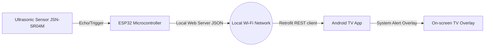

# Water Level Monitoring System — ESP32 + Android TV Overlay

A wireless IoT-based water level monitoring system that measures the fill level inside a tank using an **ESP32 microcontroller** and an **ultrasonic sensor**, transmitting data in real time to an **Android TV overlay application** that displays the level graphically over playback.

## System Architecture

### Hardware (ESP32 Node)
- **Sensor**: Ultrasonic sensor (HC-SR04T or JSN-SR04M) measuring distance from the sensor to the water surface.
- **Controller**: ESP32 calculates height and fill percentage based on physical tank dimensions.
- **Server**: ESP32 runs a lightweight web server that serves the live data as a JSON payload (`WATER_LEVEL_ESP32_v3.ino`).

### Software (Android TV App)
- Developed in **Kotlin** using the **MVVM** design pattern (ViewModel, Repository, Retrofit).
- Uses `BootCompletedReceiver` to launch the background overlay process automatically on boot.
- `OverlayService` spawns an on-screen window overlay consisting of 7 horizontal indicator bars that light up to represent the fill percentage (0–100%) without interrupting active media playback.
- Periodically fetches JSON data from the ESP32 server with robust error handling and automatic reconnection logic.
- Integrates audible warnings from MP3 files (`water_level_alert_loud.mp3`, `water_level_alert_soft.mp3`) when the tank reaches critical levels.

## Repository Structure
- `water_level/`: Arduino code for the ESP32 microcontroller (`WATER_LEVEL_ESP32_v3.ino`).
- `app/`: Kotlin Android TV application source, layouts, and gradle configurations.
- `WEB_PAGES_SIMULATOR/`: Python simulation tool (`fake_esp32.py`) simulating the ESP32 web server for testing without hardware.

## Hardware Pin Connections (ESP32)
- **Sensor Trigger**: Pin 5
- **Sensor Echo**: Pin 18

## Software Stack
- **Embedded**: Arduino IDE (ESP32 Board Support package)
- **Android**: Android Studio, Kotlin
- **Networking**: Retrofit, OkHttp
- **Architecture**: MVVM with LiveData\n